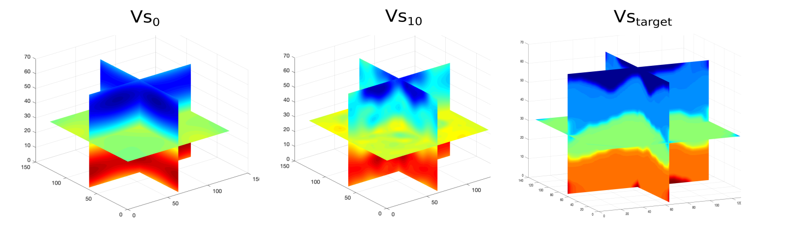

# **Curso introducción  a la inversion de forma de onda completa**
# **(RAUGM 2019) **

Workflow de la inversión de forma de onda completa para un medio elástico usando NLCG como método de optimización.

### ** Requisitos**:
* MPI - OpenMP
* Obspy

### ** Detalles**:
* Código de diferencias finitas O(2,4)
* Formulación Adjunta

### Cómo correr el ejemplo?
    python inversion.py

armando.espindolacarmona@kaust.edu.sa

### Ponentes

Alan Juarez alanjuar@usc.edu;
Armando Espíndola Carmona armando.espindolacarmona@kaust.edu.sa;
Carlos Mendoza mendozac@geociencias.unam.mx;
Leonardo Ramirez-Guzman lramirezg@iingen.unam.mx
